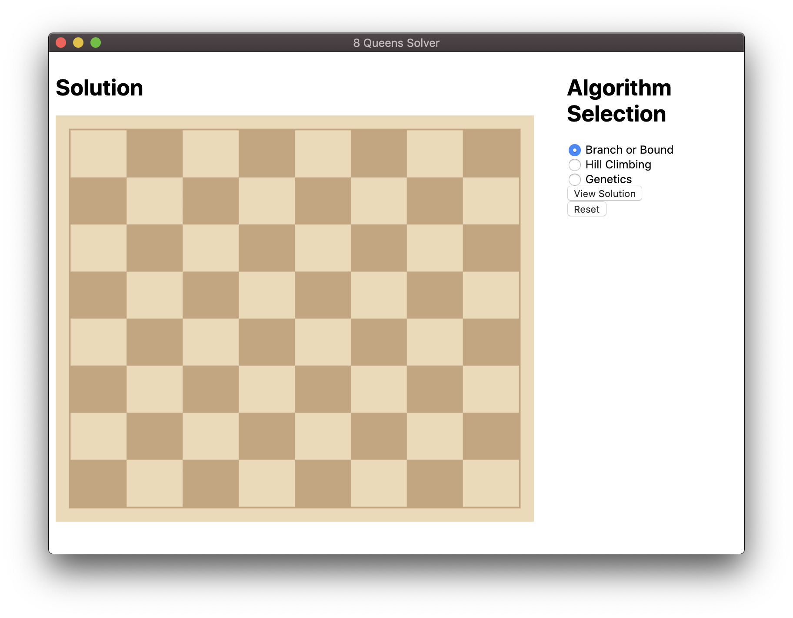
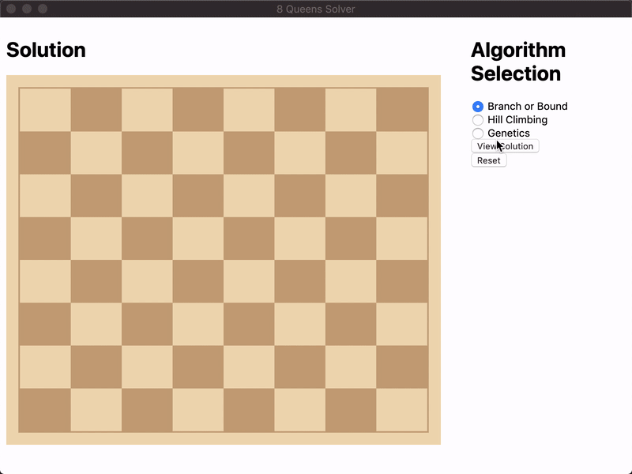

# 8queens 👑


## Table of Contents
- [Running 8queens](#running-8queens-)
  * [Step One - Get the Source Code](#step-one---get-the-source-code)
  * [Step Two - Step Two Install npm](#step-two---install-npm)
  * [Step Three - Install Dependencies](#step-three---install-dependencies)
  * [Step Four - Run The App Locally](#step-four---run-the-app-locally)
- [Interacting with the GUI](#interacting-with-the-gui-)
  * [Branch or Bound](#branch-or-bound)
  * [Hill Climbing](#hill-climbing)
  * [genetics](#genetics)
- [Built With](#built-with-)
- [Special Thanks To](#special-thanks-to-)

## Running 8queens 💻
### Step One - Get the Source Code
Clone this repository by opening up the command line and running the following:
```shell script
mkdir 8queens
git clone https://github.com/mlabisi/8queens.git
cd 8queens
```

### Step Two - Install `npm`
Make sure you have `npm` installed on your laptop! You can install it by going to the [official site](https://www.npmjs.com/get-npm).

### Step Three - Install Dependencies
Now that you've installed the package manager, you're ready to install dependencies!  You can do so by simply typing `npm install` in the 8queens directory.
> Dependencies are the `npm` packages that our project depends on. The `project.json` file contains a list of all of the dependencies for our project, but it doesn’t actually install them--we need to run the `npm install` command.

### Step Four - Run The App Locally
Now that the dependencies have been installed, you can run 8queens locally! To do so, go ahead and use this command: `npm run start`.

## Interacting with the GUI 🕹
The 8queens GUI is very simple. Use the radio buttons on the right-hand side of the screen to select the algorithm you'd like to run.

### Branch or Bound

> This optimization-based algorithm places the queens on the board randomly, one per column. The algorithm then works to reduce the number of pairs of attacking queens. 


### Hill Climbing

> Using the concept of the global optimum, this algorithm starts with one queen per column, then moves queens one at a time, each one within its own column.
_If the algorithm gets stuck at the local optimum, a new random state will be generated and the process will repeat._

### Genetics

> Based on the theory of evolution and natural selection, this algorithm introduces the concepts of populations, generations, and mutations in order to implement a "survival-of-the-fittest" strategy. The most optimal successor is chosen for each generation.

## Built With 🛠
[Electron](https://www.electronjs.org/)

[Node.js](https://nodejs.org/en/)

## Special Thanks To 💖
[selimfirat](https://github.com/selimfirat/ai-n-queens)

[cm-chessboard](https://github.com/shaack/cm-chessboard)
